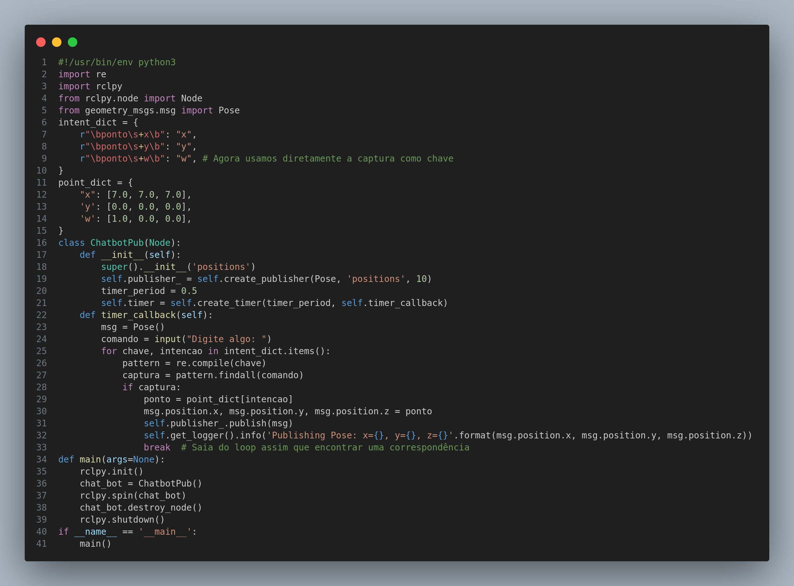

# Chatbot

Na Sprint 2, buscamos criar um chat simples que empregasse um publisher para encaminhar informações do usuário a um tópico denominado "positions" no código. Este chat foi concebido para operar na linha de comando (CLI), enquanto as informações do usuário seriam processadas por meio de expressões regulares (regex) para extrair os dados pertinentes.

Durante o processo, estabelecemos expressões regulares no dicionário denominado "intent_dict", no qual cada expressão estava vinculada a uma intenção específica do usuário. Por exemplo, a expressão regular r"\bponto\s+x\b" correspondia à intenção "x". Essas intenções refletiam os diversos tipos de solicitações que os usuários poderiam realizar na plataforma, oferecendo uma estrutura organizada para compreender e responder às necessidades dos usuários.

Adicionalmente, elaboramos um dicionário denominado "point_dict" para correlacionar pontos específicos a cada intenção. Cada intenção continha um conjunto de pontos previamente determinados que seriam acionados como a próxima movimentação do robô. Esses pontos, fixos no almoxarifado, refletiam as restrições e características específicas do ambiente, oferecendo um mapeamento claro das possíveis ações do robô de acordo com as intenções dos usuários.

O script incorpora a classe "ChatbotPub(Node)", especificamente criada para estabelecer um publisher ROS (Robot Operating System) destinado ao tópico "positions". Esse tópico é projetado para ser consumido por um script de navegação, facilitando uma comunicação eficaz e ágil entre diferentes componentes do sistema, permitindo uma integração fluida e coordenada das operações do robô.

Na implementação anterior, enfrentamos desafios significativos ao integrar plenamente essa solução, levando à opção de manter o script em um único arquivo. O ROS não foi empregado conforme planejado; em vez disso, optamos por transmitir diretamente uma lista de pontos ao robô simulado no Gazebo para sua sequência de movimentos. Essa abordagem simplificada foi adotada temporariamente para garantir a continuidade do progresso, mas o objetivo principal da próxima fase é reverter essa decisão e retomar a implementação original, visando uma integração completa do ROS para aprimorar a comunicação e o controle do robô.

A intenção é desvincular os elementos do sistema, evitando a dependência de incluir o ROS no mesmo arquivo, buscando um aumento na eficiência do código. A proposta é voltar à implementação original, na qual o publisher ROS seria empregado para estabelecer uma comunicação mais sólida e adaptável entre os distintos componentes do sistema. Essa abordagem possibilitaria uma integração mais eficiente e modular, o que, por sua vez, aprimoraria a escalabilidade e a facilidade de manutenção do código, promovendo um desenvolvimento mais robusto e flexível do sistema como um todo.

 Script de chatbot usando subscriber e regex 

