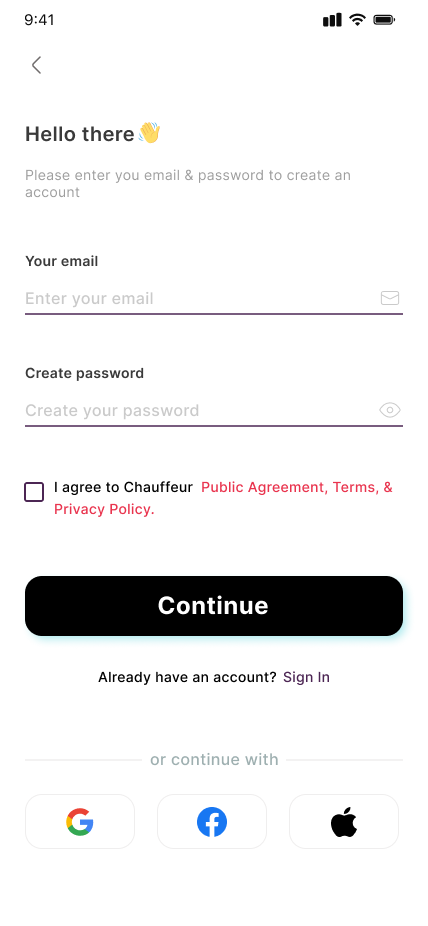

# Interface de usuário

Nossa interface contempla um aplicativo móvel que possui um chatbot integrado capaz de compreender um problema e procurar uma solução com uma lista de instruções, ferramentas e peças que devem ser utilizadas para resolver esse problema. Além disso, há também a possibilidade de integração em nuvem com o SAP, permitindo que técnicos de manutenção consigam acompanhar os status de estoque e entrega dos itens do almoxarifado sem ter que ir até lá confirmar.

## Onboarding

As primeiras telas quando o aplicativo é inicializado formam um onboarding, apresentando a motivação do chatbot e algumas possibilidades de uso do aplicativo.

## Signin e Signup

Nossa aplicação também possui uma forma de login e cadastro para que os técnicos de manutenção possam se identificar ou criar uma conta.

## Chatbot

A ideia do chatbot é que o técnico de manutenção possa perguntar ou falar sobre algum problema ou defeito que encontrou e, consoante manuais de manutenção, ele instrua o técnico a resolver o problema e diga quais ferramentas e peças ele precisa para resolver esse problema.

## Integração SAP

Por último, a fim de tirar a necessidade do técnico de manutenção ir até o almoxarifado verificar se há a peça que ele pediu, o aplicativo conta com a possibilidade de integrar o SAP do almoxarifado.

