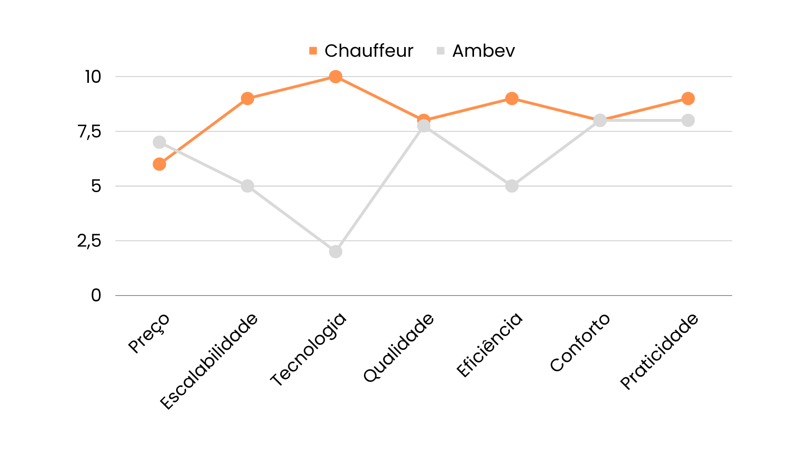

# Oceano azul

A Matriz Oceano Azul foi desenvolvida com o objetivo de descobrir novas oportunidades de mercado e criar um produto único de alta qualidade, diferente dos concorrentes. Ademais, é possível ter um maior entendimento do que a Ambev precisa e trazer melhorias/adaptações para o protótipo final atendendo às expectativas e necessidades da empresa.

Nossa matriz oceano azul foi feita com base na análise entre nosso produto e os atuais concorrentes no mercado de robôs de auto-atendimento. Levamos em conta 6 atributos, são eles: 

1. Preço: Isso ainda envolve a relação custo-benefício da solução em comparação com as alternativas existentes. É importante considerar se a solução de robô é acessível para a Ambev e se oferece uma economia significativa em relação aos métodos tradicionais.
2. Escalabilidade: A capacidade de expansão da solução é crucial para atender às necessidades da Ambev. Isso envolve avaliar se o robô pode ser facilmente dimensionado para atender a um aumento na demanda ou à expansão da operação da Ambev.
3. Tecnologia: A inovação tecnológica ainda é um diferencial importante, como mencionado em sua primeira versão da matriz. Garantir que a tecnologia seja de ponta é fundamental para manter a solução competitiva e relevante.
4. Qualidade: A qualidade do robô é essencial para garantir um desempenho consistente e duradouro. A solução deve atender aos padrões de qualidade da Ambev e ser confiável em suas operações.
5. Eficiência: A eficiência é uma métrica importante e está relacionada à capacidade do robô de executar tarefas de forma rápida e precisa. Deve ser capaz de melhorar a produtividade da Ambev.
6. Conforto: O conforto do usuário ainda é relevante, pois afeta a experiência dos operadores ao interagir com o robô. O robô deve ser fácil de usar e proporcionar uma sensação de segurança e eficiência.
7. Praticidade: A praticidade, envolvendo a facilidade de integração do robô com os sistemas e processos existentes da Ambev, é uma métrica importante para garantir que a solução se adapte bem ao ambiente de trabalho da empresa.

**Eliminar**

- Eliminar o desperdício de tempo que os operadores gastam procurando manualmente as peças no almoxarifado.
- Eliminar a necessidade de treinamento intensivo para novos operadores, pois o robô pode orientá-los.

**Criar**

- Criar um arquivo CSV com todas as operações realizadas no dia, o que permite uma melhor rastreabilidade e integração com outros sistemas da empresa, contribuindo para a gestão de estoque.
- Criar um ambiente de almoxarifado mais eficiente e menos dependente de recursos humanos para tarefas manuais de busca, liberando os operadores para atividades mais estratégicas.

**Reduzir**

- Reduzir os erros na entrega de peças, evitando discrepâncias entre o sistema e o estoque físico, melhorando a satisfação do cliente interno (operadores).

**Elevar**

- Elevar a capacidade do chatbot de recomendar peças adicionais ou alternativas com base nas necessidades do operador, além de personalizar suas respostas e recomendações com base no histórico de solicitações do operador.
- Elevar a capacidade do sistema de integração com outros sistemas da AMBEV, como o sistema de gestão de estoque e manutenção.
- Implementar tecnologias de eficiência energética no robô para aumentar sua autonomia e reduzir custos operacionais.

Após uma análise cuidadosa do gráfico e de fatores externos, identificamos os fatores que devem ser eliminados, reduzidos, aumentados e criados em nosso projeto. Essa abordagem nos permitirá construir sobre as melhores práticas existentes, ao mesmo tempo em que buscamos diferenciar-nos com melhorias e adaptações específicas para atender às expectativas e necessidades da empresa Ambev.
