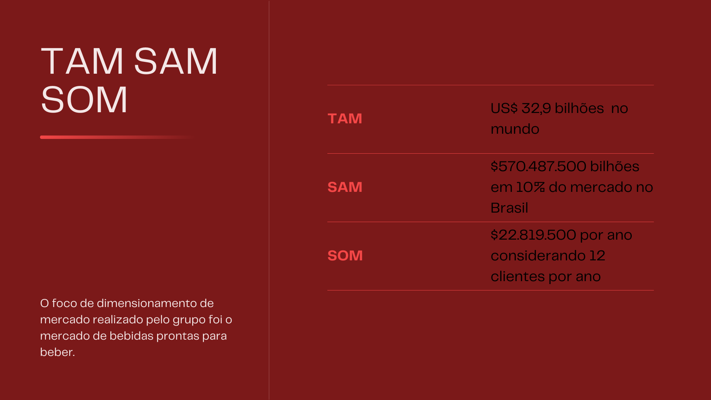

# TAM SAM SOM

Os conceitos de TAM, SAM e SOM são ferramentas valiosas para empreendedores ao analisar diferentes segmentos de um mercado e prever a demanda, vendas e crescimento de seus produtos ou serviços. Vamos aplicar esses conceitos ao contexto da Ambev, uma das maiores empresas de bebidas do mundo, que produz e distribui cervejas, refrigerantes e outras bebidas alcoólicas e não alcoólicas.

Em resumo, o TAM representa o mercado total, o SAM é a parte desse mercado que a empresa pode abordar de maneira eficaz, e o SOM é a fração desse mercado que a empresa pode efetivamente conquistar, levando em consideração variáveis específicas e um planejamento estratégico adequado. Esses conceitos auxiliam os empreendedores na definição de estratégias de crescimento de forma mais precisa.

 

 Total Available Market, Serviceable Available Market, Serviceable Obtainable Market 

